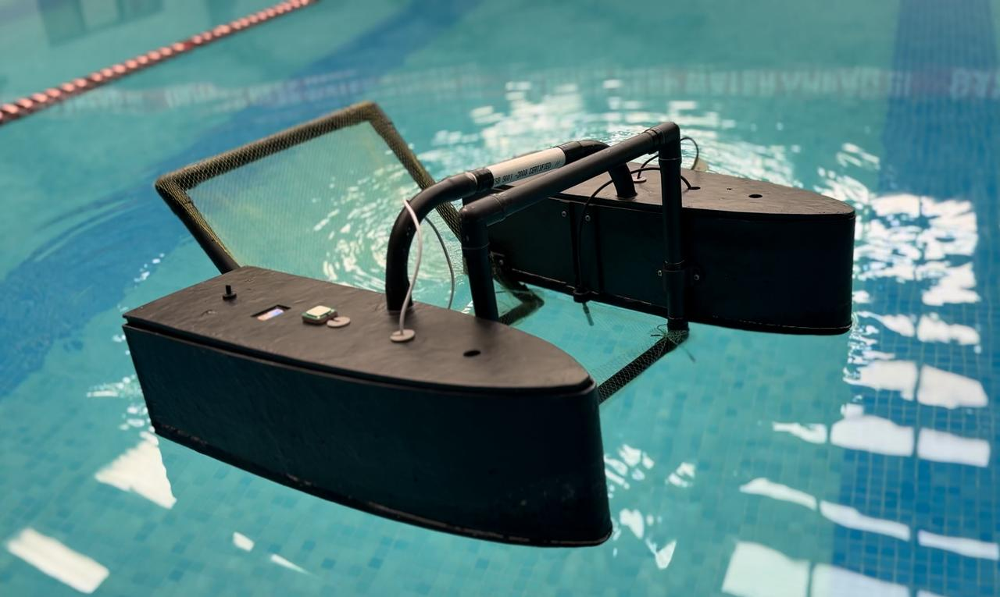
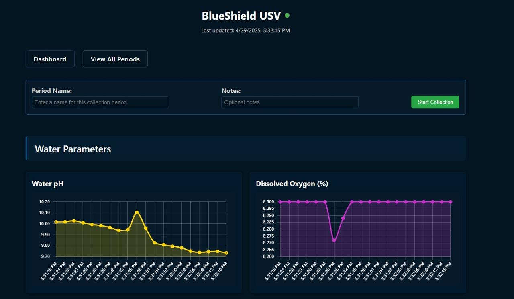

# BlueShield-USV
**Smart Water Surface Drone for Real-Time Water Quality Monitoring & Heavy Metal Prediction**

BlueShield is an interdisciplinary final year project focused on addressing the growing problem of freshwater contamination, especially due to **heavy metals** like **arsenic, barium, and lithium**. This project combines **embedded systems, IoT, full stack and machine learning** to build a fully functional **water surface drone** capable of monitoring water quality in real-time and predicting heavy metal concentrations.

---

## Problem Statement

Millions of people are exposed to contaminated water with harmful heavy metals, posing severe health risks such as organ damage, cancer, and neurological issues. Traditional water testing methods are slow, manual, and lack real-time capabilities. BlueShield aims to provide an **automated, scalable, and intelligent** solution for **real-time detection and reporting of water quality and contamination levels**.

---
## 📁 Key Files in This Repository
### 1. [`transmitter_combined.cpp`](./transmitter_combined.cpp)
This is the main firmware running on the **ESP32** microcontroller located on the **USV (drone)**.

**Responsibilities:**
- Collects real-time data from **pH, EC, TDS, DO, and Temperature sensors**
- Acquires **GPS location** data
- Sends data over **LoRa (433 MHz)** in a compact, structured format
- Periodically transmits sensor readings to the receiver module

---

### 2. [`receiver_combined.cpp`](./receiver_combined.cpp)
This is the receiver-side code running on another ESP32 or microcontroller that handles incoming data packets.

**Responsibilities:**
- Receives sensor and GPS data via **LoRa**
- Parses and processes the data for visualization or logging
- Connects with the backend or displays results on a serial monitor/app
- Acts as a bridge between hardware and the **Flask-based web portal**

---

## 🌐 Web Portal — Water Quality Dashboard

A full-stack **Flask-based web application** was developed to visualize and manage all incoming data from the drone. This portal includes:

- 📊 **Live sensor data feed**
- 📍 **GPS-based drone location tracking**
- 🔬 **Predicted concentrations of heavy metals (Arsenic, Barium, Lithium)**
- 🧠 **Historical trend analysis and analytics**
- ⚙️ **API integration with receiver-side ESP32 for real-time updates**

📎 **GitHub Repo:**  
👉 [Water-Quality-Dashboard](https://github.com/azzan02/Water-Quality-Dashboard.git)

> *The dashboard serves as the primary interface for environmental monitoring and decision-making.*

---

## 🧠 Machine Learning Component

Sensor values are used as input for pre-trained ML models (e.g., **Random Forest**) to estimate the concentrations of:
- Arsenic
- Barium
- Lithium

The models were trained on a dataset of water quality parameters and deployed via the Flask app.

---

## ⚙️ System Architecture Overview

- **ESP32** collects data from:
  - pH sensor
  - Electrical Conductivity (EC) sensor
  - Total Dissolved Solids (TDS) sensor
  - Dissolved Oxygen (DO) sensor
  - Temperature sensor
  - GPS module
- Sends data to a remote receiver using **LoRa**
- Data is sent to the **web dashboard** for real-time insights and historical analytics

---
## 📸 Images & Demo

### Drone Prototype

### Web Dashboard UI

